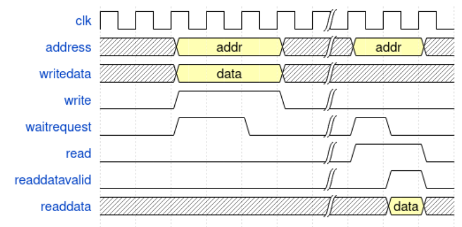
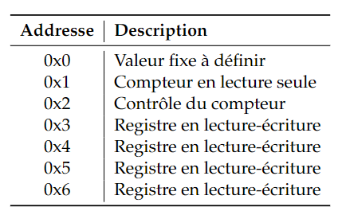
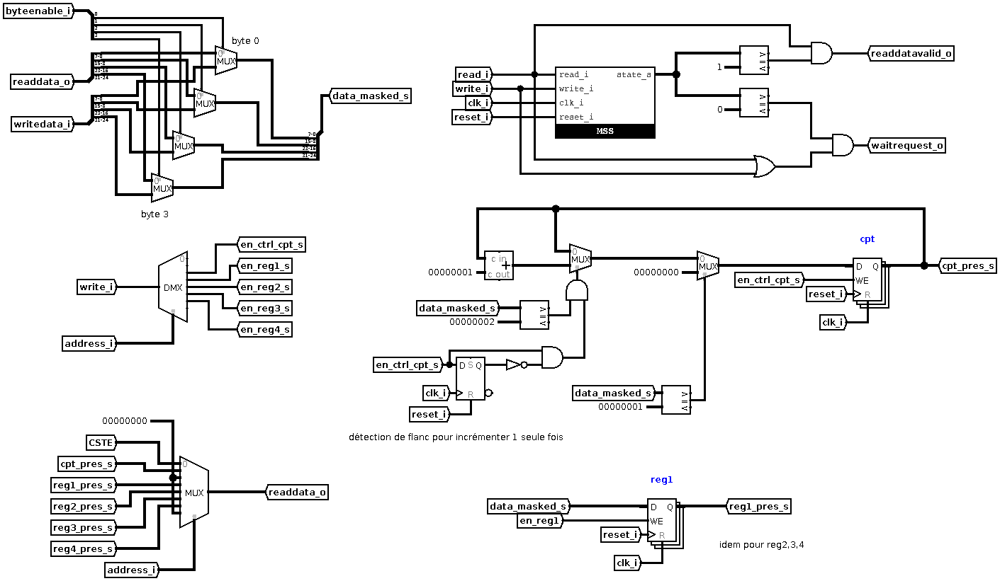
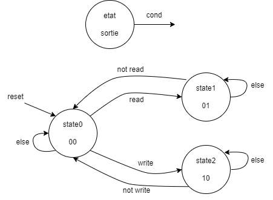
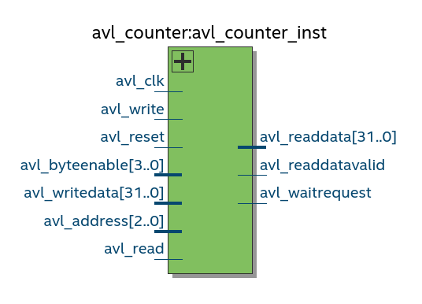
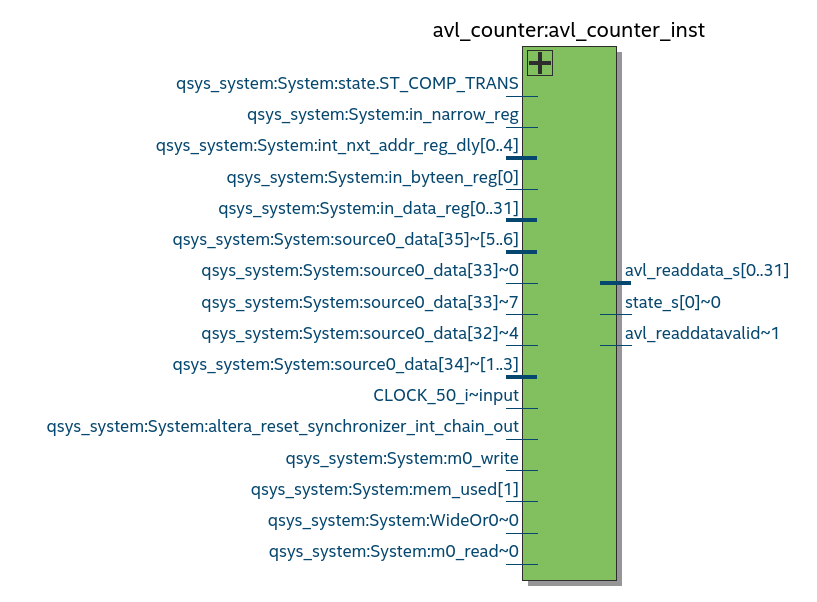
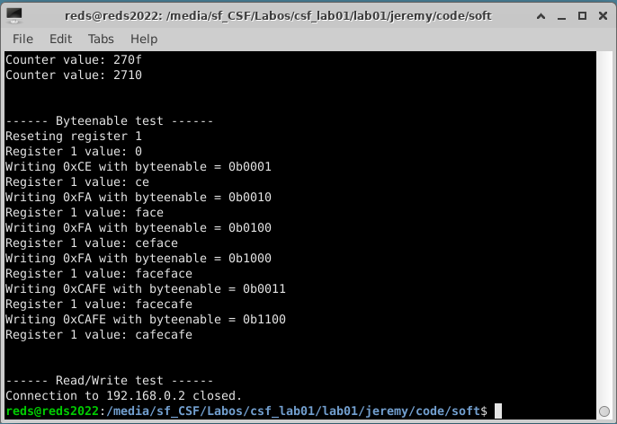

# CSF Lab01: Réalisation d'un bloc simple sur bus avalon, prise en main des outils de simulation, synthèse et placement-routage

## Introduction 
Le but de ce laboratoire est la prise en main des outils de simulation et de synthèse, ainsi que la réalistion d'un composant relativemetn simple. Ce composant sur bus avalon doit également être vérifié. Une observation des résultats en synthpse et un test sur la carte sont aussi à effectuer.

Le fonctionnement des signaux de notre composant pour le bus avalon doit respecter le chronogramme suivant:

Les registres auxquels nous devons pouvoir accéder sont les suivants:

Le premier registre doit juste fournir une valeur pré-définie. Il pourrait s’agir d’un code particulier ou un numéro de version.
Le deuxième est un compteur accessible en lecture seule.
Le troisième est un registre de contrôle pour le compteur. Y écrire la valeur 0x1 remet le compteur à 0, et y écrire la valeur 0x2 lance une incrémentation du compteur.
Les derniers sont quatre registres sur 32 bits, accessibles en lecture/écriture.

## Choix structurels pour le répertoire de travail

Afin de pouvoir travailler facilement sur des descriptions différentes tout en utilisant github, nous avons mis en place 3 répertoires, un pour chaque membre du groupe. Ces répértoires ont tous la même structure qui est celle du projet qui nous a été fourni.

## Étape 1 

Dans cette étape, le but est d'illustrer le système à travers un schéma.

### Schéma de Jeremy

Voici le schéma réalisé par Jeremy:

Voici également le graph d'état de la MSS:

Étant donné la complexité de ce laboratoire, Jeremy a décidé de ne pas implémenter de machine 'UC / UT' car celle-ci ne serait pas justifiée. Ma schématique est divisée en blocs selon la liste suivante :

1. Masquage de _writedata_ selon le _byteenable_
2. Enable des registres en écriture
3. Sélection du registres à lire pour la sortie _readdata_
4. MSS de Mealy pour gestion de _readdatavalid_ et _waitrequest_
5. Machine de 'Medvedev' pour le registre du compteur
6. 4 mémoires pour les registres 1 à 4

Cette décomposition est celle retenue après les modifications effectuées suite aux problèmes rencontrés. La raison de ces modifications sont explicitées dans l'étape 2.

### Schéma de Kristina

## Étape 2

Cette seconde étape couvre la description VHDL du composant.

### Description VHDL de Jeremy

#### Choix

Dans un premier temps, Jeremy a retranscrit le schéma en code vhdl. La liste ci-dessous décrit les décisions prises pour le code, en reprenant la numérotation des blocs du schéma:

1. Pas besoin d'être synchrone, `when else` suffisant.
2. *Process* avec détection `reset` et flanc montant `clk`. Cela permet de donner une valeur par défaut aux signaux et de les changer uniquement au passage d'un flanc montant, et ce uniquement avec `write = '1'`.
3. *Process* avec détection `reset` et flanc montant `clk`. _readdata_ se met à jour de manière synchrone et seulement si  `read = '1'`. 
4. La MSS n'a pour sortie que ses bits d'états, cela permet de mettre en place une gestion de type MSS de Mealy pour les signaux  _readdatavalid_ et _waitrequest_.
5. *Process* avec détection `reset` et flanc montant `clk`.  Le registre du compteur est mis à jour avec sa nouvelle valeur qui est soit remise à '0' soit incrémentée (pour cela, description de mux).
6. *Process* avec détection `reset` et flanc montant `clk`. Les 4 registres sont séparés selon le signal d'enable et, le cas échéant, sont mis à jour avec les valeurs d'entrées. 

#### Problèmes rencontrés

Retard sur les signaux _readdatavalid_ et _waitrequest_ :

Lors de l'exécution de celui-ci à travers du testbench, il se trouve que les sigaux de sortie _readdatavalid_ et _waitrequest_ se déclanchent avec une période de retard. Le code initial présentait une détection des flancs montants sur les signaux `write` et `read` avec une logique combinatoire en aval. Cette méthode qui créait un retard a été remplacée par une MSS qui corrige ces erreurs.

Compteur incrémenté continuellement:

Dans la première version, le compteur s'incrémentait continuellement tant que la valeur de `0x02` était écrite dans son registre de contrôle et que le signal write restait à `1`. Comme nous voulions effectuer une seule incrémentation, Jeremy a ajouté une détection de flanc sur le signal enable du compteur. A présent, une seule incrémentation a lieu. 

### Description VHDL de Kristina

## Étape 3

Dans cette étape, Basile a été amené à mettre en place un testbench pour pouvoir vérifier le composant décrit en VHDL par Jeremy et Kristina.

#### Mise en place du script sim.do

La première partie du travail pour le testbench a été de mettre en place un script permettant de lancer la simulation.

N'ayant jamais mis en place plus que les tests d'un testbench pendant le cours VSE, la mise en place de ce script n'a pas été aisée, mais en se basant sur des projets de VSE, un résultat fonctionnel a pu être obtenu.

Deux descriptions VHDL ayant été mises en place, le script se situe dans le dossier de Basile et permet, via un paramètre, d'aller chercher les sources VHDL dans le répertoire de Jeremy ou Kristina.

Ce script se lance de la manière suivante (depuis un répertoire /basile/code/hard/sim): do ../scripts/sim.do jeremy|kristina 0 

Le troisième paramètre (0) de la commande de lancement de script permet la sélection d'un testcase, le composant étant relativement simple à vérifier, cela a été mis en place dans le script, mais pas dans le testbench lui même, c'est surtout une fonctionnalité mise en place pour des travaux futurs.

#### Mise en place des tests 

Le testbench a été écrit en SystemVerilog, cela paraissait être la meilleure solution, ou du moins la plus aisée. De plus, les tests étant relativement faciles à lire dans ce langage, il était plus simple d'expliquer les tests à Jeremy et Kristina.

Tout d'abord, deux bfm ont été mis en place, ceux-ci permettent de simuler une lecture ou écriture sur le bus Avalon de manière lisible. Ces bfm contiennent quelques assertions quant au comportement des différents signaux, une task permettant d'attendre un événement sur un signal (avec timeout) a également été mise en place. De plus, deux assertions de propriétés ont été mises en place: avl_waitrequest ne doit jamais être à 1 en même temps que avl_readdatavalid et avl_write ne doit jamais être à 1 en même temsp que avl_readatavalid.

Concernant les tests, la constante a tout d'abord été vérifiée via une simple lecture, puis, les registres aux adresses 3, 4, 5 et 6 ont été testés.

Pour chaque registre, plusieurs boucles ont été mises en place: une première pour tester des écritures et relectures de valeurs proches de 0, une seconde pour tester des valeurs proches de la valeur maximale obtenable en 32 bits et une troisième permettatn de tester des valeurs "normales" en partant de 0 et avec des incréments de 100. 

Pour chacune de ces boucles, une vérification supplémentaire a été ajoutée, par exemple, avec une écriture dans le registre 3, il ne fallait pas que la valeur des autres registres ne soit modifiée. Cette vérification n'a d'ailleurs été mise en place que pour les registres 32 bits accessibles en lecutre écriture, puisque dans les descriptions VHDL, ils ont été traités dans le même process.

Le byteenable a ensuite pu être testé, Les tests utilisaient principalement des suites de remise à 0 des registres, puis une écriture de la valeur 0xFFFFFFFF avec des byteenable différents. Les combinaisons de byteenable testées sont basiquement les 4 mots de 8 bits, les deux mots de 16 bits (alignés) et un mot de 32 bits.

Pour finir, le compteur a pu être testé. Il a d'abord été remis à 0, puis incrémenté 1000 fois avant d'être à nouveau remis à 0. De plus, un test a été effectué dans lequel les datas écrites sur le registre de commande du compteur ne correspondaient pas à la valeur 0x1 ou 0x2 et donc, aucun effet ne devait être constaté sur le compteur.

Le testbench se termine ensuite par un $finish.

## Étape 4

Dans cette étape, nous avons lancé la synthèses / placement / routage comme demandé, puis nous avons pu afficher les différentes vues à l'aide de Quartus.

Afin de ne pas surcharger ce rapport, nous avons décidé de ne mentionner que les vues obtenues avec l'implémentation de Jeremy, puisque les deux descriptions réalisées présentent les mêmes caractéristiques.

Voici donc le résultat obtenu pour la vue RTL:

Voici le résultat obtenu pour la vue Technology Map:

Nous avons pu constater que la vue RTL nous donne une représentation de notre composant fidèle à ce que nous avons décrit, en n'affichant que les signaux que nous avons mis en place. La vue Technology Map donne quant à elle une représentation bien plus complexe du composant, représentation qui prend en compte bien plus de signaux probablement relatifs à la synthèse ou aux différents signaux de la DE1-SoC.

## Étape 5 

Dans cette étape, nous avons effectué l'intégration du notre description VHDL sur la FPGA en suivant les différentes instructions de la donnée, puis nous avons testé le fonctionnement en nous appuyant sur le programme C fourni. 

Le résultat obtenu sur le terminal est le suivant:

Basile s'est ensuite occupé de modifier le fichier C afin de réaliser les mêmes tests que dans le testbench. Voici le résultat obtenu dans le terminal au terme de ces tests: 

A noter que pour ces tests, en cas d'erreur un message est affiché, le fait de n'afficher que les différentes étapes en cours de test sans erreur atteste donc du bon fonctionnement de notre solution.

## Conclusion 

